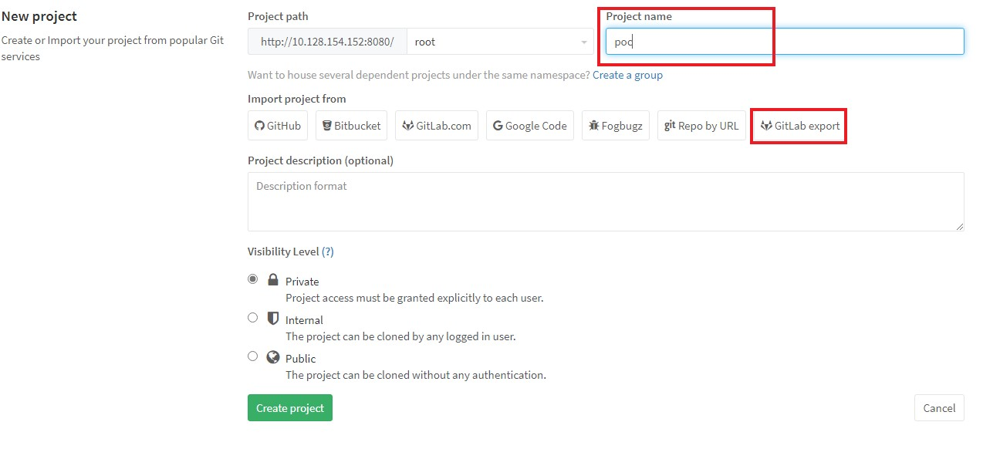
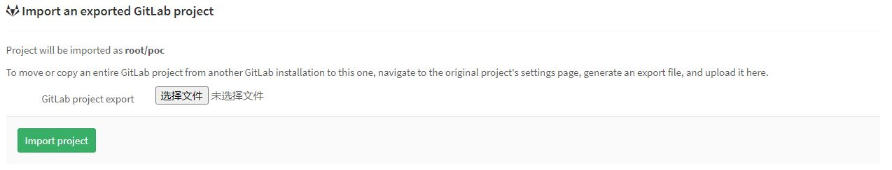
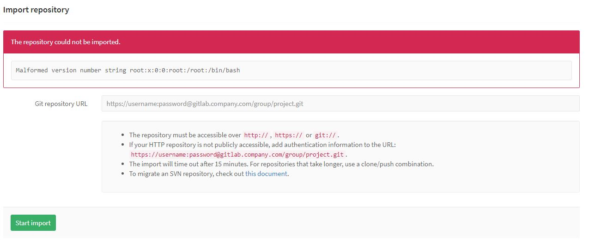

# Gitlab Arbitrary File Read Vulnability(CVE-2016-9086)

## Introduction

GitLab versions `8.9.x` and above contain a critical security flaw in the "`import/export project`" feature of GitLab. Added in GitLab `8.9`, this feature allows a user to export and then re-import their projects as tape archive files (tar). All GitLab versions prior to `8.13.0` restricted this feature to administrators only. Starting with version `8.13.0` this feature was made available to all users. This feature did not properly check for symbolic links in user-provided archives and therefore it was possible for an authenticated user to retrieve the contents of any file accessible to the GitLab service account. This included sensitive files such as those that contain secret tokens used by the GitLab service to authenticate users. GitLab CE and EE versions `8.13.0` through `8.13.2`, `8.12.0` through `8.12.7`, `8.11.0` through `8.11.10`, `8.10.0` through `8.10.12`, and `8.9.0` through `8.9.11` are affected.

## Setup

Run

```bash
export GITLAB_HOME=/srv/gitlab
docker-compose up
```

and access to `http://localhost:8080`, login and enable import/export feature in `http://domain/admin/application_settings`.

## Poc

Run

```bash
python3 CVE-2016-9086.py
```

or manualy.

Create a new project, fill the name and click `Gitlab Export`



Upload a file, and click `Import project`



After that, access to `http://10.128.154.152:8080/root/poc/import/new`



## References

1. https://paper.seebug.org/104/
